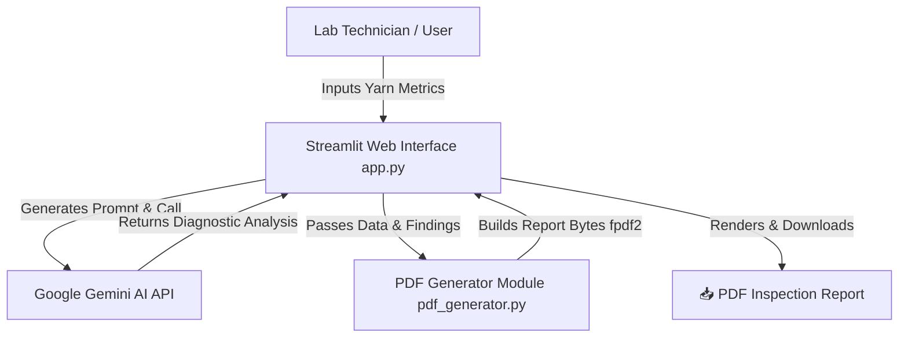

# 🧵 AI Textile Defect Assistant

[](https://ai-yarn-defect-assistant.streamlit.app)
[](https://www.python.org/)
[](https://aistudio.google.com/)
[](LICENSE)

An AI-powered quality control assistant designed for textile testing laboratories. The application accepts yarn measurement metrics (**Yarn Count**, **Thick Places**, **Thin Places**, and **Neps**), evaluates defect severity using **Google Gemini AI**, provides practical root-cause diagnostics for lab technicians, and exports official **PDF Inspection Reports**.

🔗 **Live Application**: [https://ai-yarn-defect-assistant.streamlit.app](https://ai-yarn-defect-assistant.streamlit.app)

---

## ✨ Key Features

- 🧠 **AI-Assisted Quality Diagnostics**: Evaluates raw defect metrics against yarn count systems (**Ne**, **Tex**, **Nm**, **Denier**) to deliver actionable machinery diagnostics (carding wire wear, drafting roller tension, raw material contamination).
- 📄 **Downloadable PDF Lab Reports**: Generates downloadable PDF quality reports complete with laboratory header branding, batch metadata tables, timestamping, and formatted AI diagnostic notes via `fpdf2`.
- 🎨 **Textile Aesthetic & Custom Styling**: Styled with a vintage laboratory design system, custom CSS typography (`IBM Plex Sans` & `Special Elite`), animated spinning yarn spools, and custom loading animations.
- ⚡ **Session State Persistence**: Seamlessly retains batch details and diagnostic history across UI interactions.
- ☁️ **Cloud Native & Secure**: Fully deployed on Streamlit Community Cloud with secure API key environment management.

---

## 🏗️ System Architecture



---

## 🛠️ Tech Stack

- **Frontend & Framework**: [Streamlit](https://streamlit.io/)
- **Artificial Intelligence**: [Google Gemini API](https://ai.google.dev/) (`google-genai` SDK)
- **PDF Generation**: [FPDF2](https://pyfpdf.github.io/fpdf2/)
- **Environment Management**: `python-dotenv`
- **Deployment Platform**: [Streamlit Community Cloud](https://streamlit.io/cloud)

---

## 📁 Repository Structure

```
ai-textile-defect-assistant/
├── app.py                  # Main Streamlit web application & UI components
├── pdf_generator.py        # PDF layout builder, Unicode sanitizer & FPDF2 engine
├── requirements.txt        # Project dependencies
├── README.md               # Project documentation & overview
├── .env.example            # Environment variable template
└── .streamlit/
    └── config.toml         # Custom Streamlit layout & theme configuration
```

---

## 🚀 Local Installation & Setup

### Prerequisites
- Python 3.10 or higher
- A Google Gemini API Key from [Google AI Studio](https://aistudio.google.com/apikey)

### Steps

1. **Clone the Repository**
   ```bash
   git clone https://github.com/SuryaSrekanth/ai-textile-defect-assistant.git
   cd ai-textile-defect-assistant
   ```

2. **Set Up Virtual Environment**
   ```bash
   # On Windows
   python -m venv .venv
   .venv\Scripts\activate

   # On macOS/Linux
   python3 -m venv .venv
   source .venv/bin/activate
   ```

3. **Install Dependencies**
   ```bash
   pip install -r requirements.txt
   ```

4. **Configure Environment Variables**
   Create a `.env` file in the root directory:
   ```bash
   cp .env.example .env
   ```
   Add your Google Gemini API Key inside `.env`:
   ```env
   GEMINI_API_KEY=your_actual_api_key_here
   ```

5. **Run the Application**
   ```bash
   streamlit run app.py
   ```
   Open your browser at `http://localhost:8501`.

---

## 👤 Author

**Surya Srekanth**
- **GitHub**: [@SuryaSrekanth](https://github.com/SuryaSrekanth)
- **Live Project**: [AI Textile Defect Assistant](https://ai-yarn-defect-assistant.streamlit.app)

---

## 📜 License

Distributed under the MIT License. See `LICENSE` for more details.
