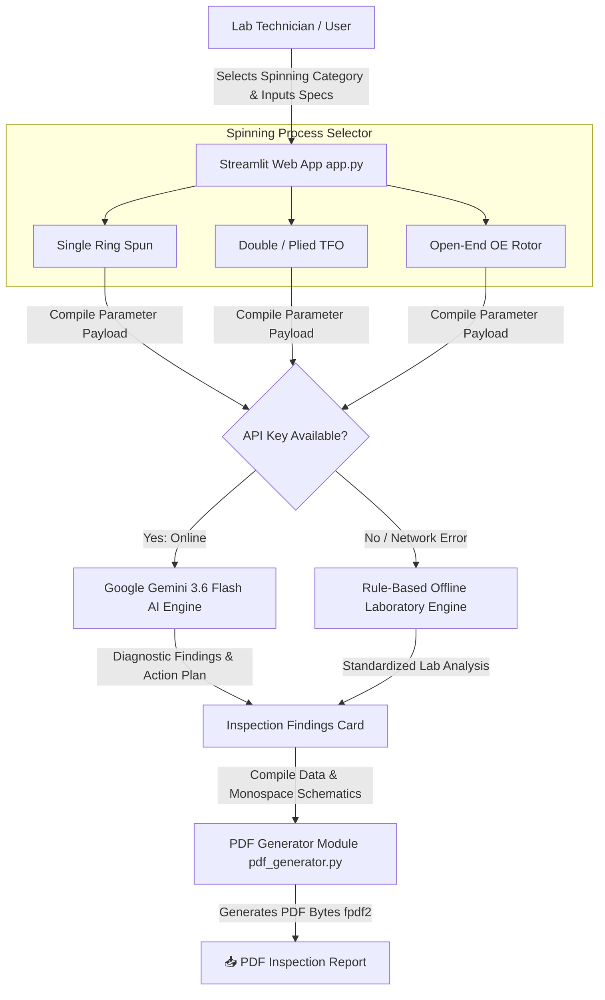

# 🧵 AI Yarn Defect Assistant

[](https://ai-yarn-defect-assistant.streamlit.app)
[](https://www.python.org/)
[](https://aistudio.google.com/)
[](Dockerfile)
[](LICENSE)

An AI-powered quality assurance and troubleshooting assistant designed for textile spinning mills and testing laboratories. The system diagnoses defect severity across **Single Ring Spun**, **Double / Plied (TFO)**, and **Open-End (OE) Rotor** yarns using **Google Gemini AI** (with an intelligent rule-based offline fallback), provides practical machinery root-cause diagnostics, and compiles official **PDF Inspection Reports**.

🔗 **Live Application**: [https://ai-yarn-defect-assistant.streamlit.app](https://ai-yarn-defect-assistant.streamlit.app)

---

## ✨ Key Features

- 🧵 **Multi-Process Spinning Diagnostics**: Specialized analysis engines tailored for **Single Ring Spun**, **Double / Plied (Two-For-One / TFO)**, and **Open-End (OE) Rotor** spinning technologies.
- 🧠 **AI-Assisted Quality Diagnostics**: Evaluates raw defect metrics against count systems (**Ne**, **Tex**, **Nm**, **Denier**) to deliver actionable department-level machinery diagnostics (carding wire wear, drafting cots, traveler weight, twist liveliness, rotor encrustation).
- 🛡️ **Dual-Engine Resilience & Graceful Error Handling**: Features a built-in **Rule-Based Offline Analysis Engine** and vintage alert banners (`.lab-error-card`). If the Gemini API key is missing or network connectivity drops, the system seamlessly generates fallback reports so PDF export never fails.
- 📄 **Downloadable PDF Lab Reports**: Exports official laboratory inspection reports via `fpdf2` featuring custom laboratory header branding, batch metadata tables, process flow schematics, timestamping, and developer attribution (**Surya Srekanth**).
- 🎨 **Textile Aesthetic & Custom Styling**: Designed with a vintage mill laboratory aesthetic, custom typography (`IBM Plex Sans` & `Special Elite`), animated spinning yarn spools, and custom loading animations.
- 🐳 **Docker & Container Ready**: Includes pre-configured `Dockerfile`, `.dockerignore`, and `docker-compose.yml` for instant, isolated deployment.
- ☁️ **Cloud Native**: Deployed on Streamlit Community Cloud with secure environment secret management.

---

## 🧵 Multi-Yarn Spinning Diagnostics

The application dynamically adapts its measurement slips, defect thresholds, and diagnostic reasoning according to the selected yarn category:

| Yarn Category | Primary Spinning Process | Specialized Measurement Parameters | Machinery & Process Diagnostics |
| :--- | :--- | :--- | :--- |
| **Single Yarn** | Ring Frame Spinning | Yarn Count, Thick (+50%), Thin (-50%), Neps (+200%) | Ring traveler wear/bluing, top roller drafting cot Shore hardness (68-70° A), apron cracking, spindle eccentricity, roving CVm%. |
| **Double / Plied Yarn** | Assembly Winding & Two-For-One (TFO) Twisting | Resultant Count (e.g. 2/40s Ne), Plies, Plied Slubs, Dropped-Ply Thin Places, Snarls / Twist Liveliness | Autoclave Yarn Conditioning Plant (YCP vacuum/steam cycles at 58-62°C), assembly doubler stop-motion sensors, pneumatic splicer strength retention (>85%), TFO ceramic flyers. |
| **Open-End (OE) Yarn** | Rotor Spinning | Yarn Count, Rotor Slubs (+50%), Fiber Starvation (-50%), Opening Neps (+200%), Trash / Micro-Dust Particles | Rotor V-groove micro-dust encrustation, ceramic navel insert wear/glaze scoring, opening roller wire tooth sharpness, trash extraction chute suction pressure (>700 Pa). |

---

## 🏗️ System Architecture


```mermaid
flowchart TD
    A[Lab Technician / User] -->|Selects Spinning Category & Inputs Specs| B[Streamlit Web App app.py]
    
    subgraph UI_Selection[Spinning Process Selector]
        B --> S1[Single Ring Spun]
        B --> S2[Double / Plied TFO]
        B --> S3[Open-End OE Rotor]
    end

    S1 & S2 & S3 -->|Compile Parameter Payload| C{API Key Available?}

    C -->|Yes: Online| D[Google Gemini 3.6 Flash AI Engine]
    C -->|No / Network Error| E[Rule-Based Offline Laboratory Engine]

    D -->|Diagnostic Findings & Action Plan| F[Inspection Findings Card]
    E -->|Standardized Lab Analysis| F

    F -->|Compile Data & Monospace Schematics| G[PDF Generator Module pdf_generator.py]
    G -->|Generates PDF Bytes fpdf2| H[📥 PDF Inspection Report]
```

---

## 🛠️ Tech Stack

- **Frontend & Framework**: [Streamlit](https://streamlit.io/)
- **Artificial Intelligence**: [Google Gemini API](https://ai.google.dev/) (`google-genai` SDK)
- **PDF Generation**: [FPDF2](https://pyfpdf.github.io/fpdf2/)
- **Containerization**: [Docker](https://www.docker.com/) & [Docker Compose](https://docs.docker.com/compose/)
- **Environment Management**: `python-dotenv`
- **Deployment Platform**: [Streamlit Community Cloud](https://streamlit.io/cloud)

---

## 📁 Repository Structure

```
ai-yarn-defect-assistant/
├── app.py                  # Main Streamlit application, UI components & error handlers
├── pdf_generator.py        # PDF layout builder, ASCII schematic renderer & FPDF2 engine
├── requirements.txt        # Python package dependencies
├── Dockerfile              # Container build definition for production deployment
├── docker-compose.yml      # Multi-container / local orchestration configuration
├── .dockerignore           # Build context exclusion rules
├── README.md               # Project documentation & usage guide
├── .env.example            # Environment variable template
└── .streamlit/
    └── config.toml         # Custom Streamlit layout & palette configuration
```

---

## 🚀 Local Installation & Setup

### Prerequisites
- Python 3.10 or higher
- A Google Gemini API Key from [Google AI Studio](https://aistudio.google.com/apikey) *(optional: offline mode works without a key)*

### Steps

1. **Clone the Repository**
   ```bash
   git clone https://github.com/SuryaSrekanth/ai-yarn-defect-assistant.git
   cd ai-yarn-defect-assistant
   ```

2. **Set Up Virtual Environment**
   ```bash
   # On Windows
   python -m venv .venv
   .venv\Scripts\activate

   # On macOS/Linux
   python3 -m venv .venv
   source .venv/bin/activate
   ```

3. **Install Dependencies**
   ```bash
   pip install -r requirements.txt
   ```

4. **Configure Environment Variables**
   Create a `.env` file in the root directory:
   ```bash
   cp .env.example .env
   ```
   Add your Google Gemini API Key inside `.env`:
   ```env
   GEMINI_API_KEY=your_actual_api_key_here
   ```

5. **Run the Application**
   ```bash
   streamlit run app.py
   ```
   Open your browser at `http://localhost:8501`.

---

## 🐳 Docker Installation & Usage

You can build and run this application inside an isolated Docker container.

### Prerequisites
- [Docker Desktop](https://www.docker.com/products/docker-desktop/) installed and running on Windows, macOS, or Linux.

### Method 1: Using Docker Compose (Recommended)

1. Make sure your `.env` file is configured with your `GEMINI_API_KEY`:
   ```bash
   cp .env.example .env
   ```
2. Build and start the container in detached mode:
   ```bash
   docker compose up --build -d
   ```
3. Open your browser at `http://localhost:8501`.
4. To stop the container:
   ```bash
   docker compose down
   ```

### Method 2: Using the Docker CLI

1. **Build the Docker Image**:
   ```bash
   docker build -t ai-yarn-defect-assistant .
   ```

2. **Run the Container**:
   ```bash
   # With your Gemini API key from .env
   docker run -d -p 8501:8501 --env-file .env --name yarn-defect-assistant ai-yarn-defect-assistant

   # Or passing the key directly
   docker run -d -p 8501:8501 -e GEMINI_API_KEY="your_api_key_here" --name yarn-defect-assistant ai-yarn-defect-assistant
   ```

3. View live container logs:
   ```bash
   docker logs -f yarn-defect-assistant
   ```

4. Stop and remove the container:
   ```bash
   docker stop yarn-defect-assistant && docker rm yarn-defect-assistant
   ```

---

## 👤 Author

**Surya Srekanth**
- **GitHub**: [@SuryaSrekanth](https://github.com/SuryaSrekanth)
- **Live Project**: [AI Yarn Defect Assistant](https://ai-yarn-defect-assistant.streamlit.app)

---

## 📜 License

Distributed under the MIT License. See `LICENSE` for more details.
